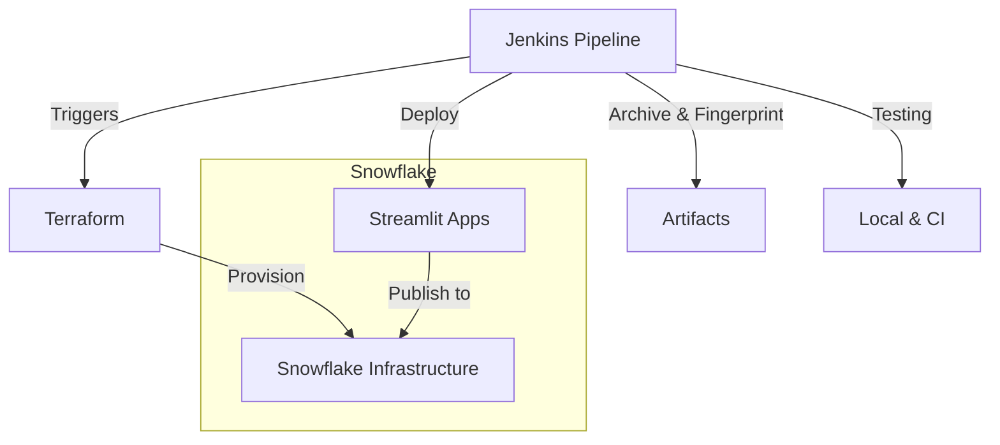

# 🧊 Snowflake Streamlit CI/CD with Terraform + Jenkins

This project demonstrates a robust CI/CD workflow for deploying [Streamlit](https://streamlit.io/) applications to [Snowflake](https://snowflake.com) using [Terraform](https://www.terraform.io/) and [Jenkins](https://www.jenkins.io/). It covers infrastructure provisioning, automated deployments, and comprehensive testing for both Terraform and Streamlit apps.

---

## 🚦 What’s Included

- **Terraform Infrastructure**  
  - Automated provisioning of Snowflake databases, schemas, stages, and Streamlit app resources.
  - Modular and testable Terraform code.
  - State management and plan/apply/destroy workflows.

- **Streamlit App Testing**  
  - Local development and testing of Streamlit apps.
  - Automated deployment to Snowflake stages via CI/CD.

- **Jenkins Pipeline**  
  - Declarative Jenkinsfile for multi-stage CI/CD.
  - Parameterized builds for branch and action selection (`plan`, `apply`, `destroy`).
  - Secure credential management for Snowflake.
  - Integration with Docker or native Terraform installation.
  - ANSI color support for readable logs.
  - Artifact archiving and fingerprinting for traceability.

- **Docker-based Jenkins Agent Node**  
  - Easily build a Jenkins agent node using Docker for consistent, reproducible CI environments.
  - Pre-installs required tools: Python, Node.js, Terraform, and SnowSQL.
  - Example Dockerfile and run instructions included for quick setup.

---

## 🐳 Creating a Docker Jenkins Agent Node

You can quickly spin up a Jenkins agent node using Docker, pre-configured with all necessary dependencies for this project.

**Build the Docker image:**
```sh
docker build -t docker-jenkins-agent ./jenkins_node
```

**Run the Jenkins agent container:**
```sh
docker run -d --name docker-jenkins-agent \
  -e JENKINS_SECRET=<your-agent-secret> \
  -e JENKINS_AGENT_NAME=docker-jenkins-agent \
  -e JENKINS_URL=http://<jenkins-server>:8080 \
  docker-jenkins-agent
```
- Replace `<your-agent-secret>` and `<jenkins-server>` with your Jenkins values.
- The container will automatically connect as a Jenkins agent node.

---

## 🏗️ Architecture Overview



**Flow Description:**
- Jenkins triggers the pipeline based on branch and action parameters.
- Terraform provisions or destroys Snowflake resources (databases, schemas, stages).
- Streamlit apps are deployed to Snowflake stages.
- Jenkins archives Terraform plans and fingerprints them for traceability.
- Testing is performed both locally and in CI for infrastructure and apps.

---

## 🧪 Testing

- **Terraform:**  
  - Validate and plan infrastructure changes before apply.
  - Use Jenkins to automate and review plans.
  - Archive and fingerprint plan files for audit.
- **Streamlit:**  
  - Run and test apps locally before deployment.
  - Deploy via Jenkins and verify in Snowflake.
  - Automated checks for app health and deployment status.

---

## 📦 Project Structure

- `/apps` – Streamlit application source code
- `/terraform` – Terraform modules and configuration
- `/jenkins` – Jenkins pipeline scripts
- `/jenkins_node` – Dockerfile and scripts for Jenkins agent node

---

## 🛠️ How to Use

1. **Fork or clone this repo.**
2. **Configure Jenkins:**  
   - Set up a Pipeline job using the provided Jenkinsfile.
   - Add Snowflake credentials as Jenkins secrets.
   - Ensure Terraform & snowsql is installed or use Docker.
   - Install the AnsiColor plugin for readable logs.
   - (Optional) Build and run the Docker Jenkins agent node as described above.
3. **Run the pipeline:**  
   - Select branch and action (`plan`, `apply`, `destroy`).
   - Review logs and stage outputs in Jenkins UI.
   - Download and inspect archived plan files if needed.
4. **Test locally:**  
   - Use Streamlit CLI to run apps before deploying.
   - Validate Terraform modules with `terraform validate` and `terraform plan`.

---

## 💡 Best Practices

- Use Jenkins credentials for all sensitive information.
- Archive and fingerprint Terraform plan files for traceability.
- Always review the plan output before applying changes.
- Modularize Terraform code for reusability and clarity.
- Test Streamlit apps locally before CI deployment.

---

## 🤝 Contributions

Issues, feature requests, and PRs are welcome!  
⭐️ the repo if you find it useful.

> Maintained by kingtvarshin. Built for learning, sharing, and scaling Snowflake + Streamlit workflows.
